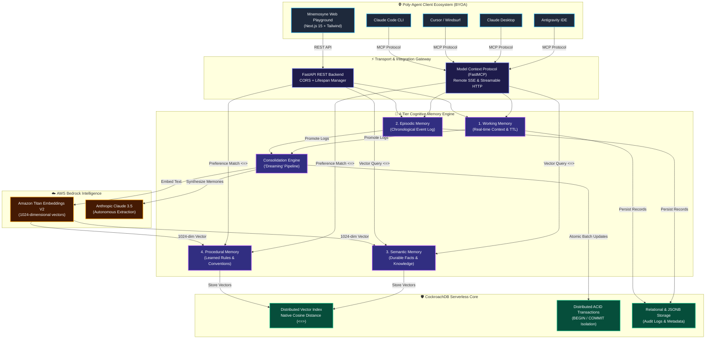

# Mnemosyne 🧠

> **Universal Agentic Memory as a Service (AMaaS) for Poly-Agent Developers — Powered by CockroachDB & AWS Bedrock**

[](https://cockroachlabs.cloud)
[](https://aws.amazon.com/bedrock/)
[-0ea5e9)](https://modelcontextprotocol.io)
[](https://nextjs.org)
[](https://fastapi.tiangolo.com)
[](LICENSE)

---

## 💡 The Problem: AI Amnesia & Siloed Tools

Modern developers don't use just one AI assistant. We jump between **Antigravity IDE, Cursor, Claude Desktop, and Claude Code CLI**.

However, each AI lives in its own walled garden with **total amnesia**:
- They forget your personal coding habits and architectural standards across sessions.
- They have no shared context with your other AI tools.
- Native memory features (like ChatGPT or Claude projects) suffer from **vendor lock-in** and lack enterprise database ownership.

**Mnemosyne solves this fundamentally.** It turns **CockroachDB Serverless** into a centralized, persistent cognitive memory layer exposed over the **Model Context Protocol (MCP)**. Teach a rule or fact once, and every AI agent in your workflow shares the exact same memory in real time.

---

## ✨ Key Features

- **🧠 Biologically-Inspired 4-Tier Memory:**
  - **Working Memory:** Fast, session-scoped active context with TTL expiration.
  - **Episodic Memory:** Full chronological conversation logs across all client sessions.
  - **Semantic Memory:** Durable facts and domain knowledge indexed with high-dimensional vectors.
  - **Procedural Memory:** Learned rules, workflows, and personal developer coding conventions.
- **🛡️ Distributed ACID Transaction Resilience:**
  Memory consolidation (the "dreaming" process that extracts short-term context into long-term knowledge) runs inside atomic CockroachDB transactions with automatic `40001` serialization retry handling.
- **🔍 Native CockroachDB Vector Search:**
  Sub-millisecond semantic retrieval using CockroachDB's native vector cosine distance operator (`<=>`) over 1024-dimensional Amazon Titan V2 embeddings.
- **⚡ Universal FastMCP Integration:**
  Connects to any MCP-compatible AI client (Antigravity IDE, Claude Desktop, Cursor, Windsurf) in just 5 lines of configuration.
- **🖥️ Full-Stack Web Playground:**
  Built with Next.js 15, TailwindCSS, and Framer Motion for real-time memory monitoring, interactive chat, and live session consolidation.

---

## 🏗️ System Architecture



---

## ⚡ Quickstart: Connect Your AI Assistant in 5 Lines

You can connect **Antigravity IDE, Claude Desktop, or Cursor** directly to the live cloud memory server:

Add this snippet to your assistant's MCP configuration file (e.g. `claude_desktop_config.json` or `mcp_config.json`):

```json
{
  "mcpServers": {
    "mnemosyne": {
      "serverUrl": "https://cockroachdb-aws-hackathon-build-with.onrender.com/mcp"
    }
  }
}
```

> **Pro-Tip for Autonomous Memory Retrieval:**
> Add this rule to your AI assistant's system instructions:
> *"CRITICAL: Before answering questions or writing code, autonomously call `search_semantic_memory` and `search_procedural_preferences` to retrieve my project rules and preferences."*

---

## 🛠️ Local Development Setup

### 1. Prerequisites
- Python 3.12+
- Node.js 20+ & npm
- A free [CockroachDB Serverless](https://cockroachlabs.cloud) cluster
- An AWS Account with [Amazon Bedrock](https://aws.amazon.com/bedrock/) access (`amazon.titan-embed-text-v2:0` and `anthropic.claude-3-5-sonnet`)

### 2. Backend Setup
```bash
cd backend
python -m venv .venv
source .venv/bin/activate  # On Windows: .venv\Scripts\activate
pip install -r requirements.txt
```

Create a `.env` file in `backend/`:
```env
COCKROACHDB_URL=postgresql://<user>:<password>@<host>:26257/defaultdb?sslmode=require
AWS_REGION=us-east-1
AWS_ACCESS_KEY_ID=<your-aws-access-key>
AWS_SECRET_ACCESS_KEY=<your-aws-secret-key>
BEDROCK_EMBEDDING_MODEL_ID=amazon.titan-embed-text-v2:0
```

Run the backend & MCP server:
```bash
uvicorn main:app --reload --port 8000
```

### 3. Frontend Web Playground Setup
```bash
cd frontend
npm install
npm run dev
```
Open [http://localhost:3000](http://localhost:3000) in your browser to interact with the memory console.

---

## ☁️ Production Cloud Deployment

### 1. Deploy Backend to Render
1. Connect your repository to **[Render.com](https://render.com)**.
2. Select **Web Service** with **Root Directory:** `backend`.
3. Set the environment variables (`COCKROACHDB_URL`, `AWS_REGION`, `AWS_ACCESS_KEY_ID`, `AWS_SECRET_ACCESS_KEY`, `BEDROCK_EMBEDDING_MODEL_ID`).
4. Deploy! Render will build the Docker container and expose the MCP endpoint at `https://<your-service>.onrender.com/mcp`.

### 2. Deploy Frontend to Vercel
1. Import the repository into **[Vercel.com](https://vercel.com)**.
2. Set **Root Directory** to `frontend`.
3. Add environment variable `NEXT_PUBLIC_API_URL` = `https://<your-render-service>.onrender.com`.
4. Deploy!

---

## 📂 Repository Structure

```
├── .agents/skills/          # CockroachDB agent skills for IDE automation
├── backend/
│   ├── app/
│   │   ├── memory/          # 4-tier memory engine (working, episodic, semantic, procedural)
│   │   ├── database.py      # CockroachDB connection pooling & vector DDL
│   │   ├── embeddings.py    # AWS Titan V2 1024-dim embedding generator
│   │   └── llm.py           # AWS Bedrock Claude 3.5 client
│   ├── mcp_server.py        # FastMCP Server definition & tools
│   ├── main.py              # FastAPI REST backend & SSE router
│   └── Dockerfile           # Production container build
├── frontend/                # Next.js 15 Web Playground & Memory Dashboard
└── README.md
```

---

## 🏆 Hackathon Track Alignment

Built with pride for the **CockroachDB × AWS Hackathon — Build with Agentic Memory**.
- **CockroachDB:** Distributed Vector Indexing (`<=>`), ACID Consolidation Transactions, and Agent Skills.
- **AWS Bedrock:** Amazon Titan Embeddings V2 (`1024-dim`) & Claude 3.5 Sonnet / Haiku.

---

## 📄 License
MIT License. Open source and available for developers everywhere.
