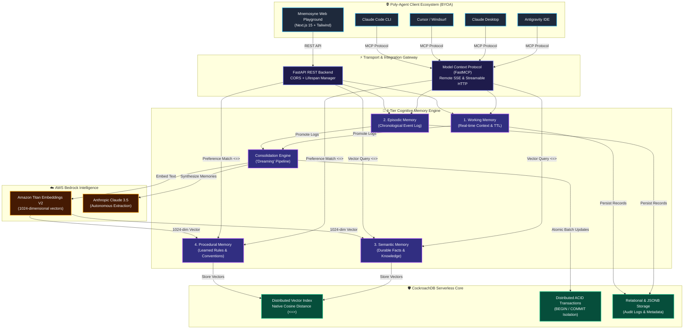

# Mnemosyne — Agentic Memory as a Service (AMaaS) 🧠

Mnemosyne is a foundational **Model Context Protocol (MCP) Server** built for the **CockroachDB × AWS Hackathon**. 

Instead of building just another chatbot, we built **Agentic Memory as a Service (AMaaS)**. Mnemosyne solves the biggest problem with modern AI agents (like Claude Desktop or Cursor): **Amnesia**. By exposing our biologically-inspired **4-Tier Memory Architecture** via MCP, any compatible AI agent can now permanently learn facts and procedural preferences about you, storing them in a highly scalable CockroachDB vector database.

## 🏆 Hackathon Requirements Compliance Matrix

| Official Requirement | Required | Our Project Implementation | Status |
| :--- | :---: | :--- | :---: |
| **CockroachDB as Persistent Memory** | **Mandatory** | 4-Tier Cognitive Memory Engine (Working, Episodic, Semantic, Procedural) stored entirely in CockroachDB Serverless. | ✅ **100% Compliant** |
| **CockroachDB Tool 1: Distributed Vector Indexing** | **Min 2** | `CREATE VECTOR INDEX` with 1024-dimensional vectors in `semantic_memories` and `procedural_memories` queried via CockroachDB's native `<=>` cosine distance operator. | ✅ **Active** |
| **CockroachDB Tool 2: CockroachDB Agent Skills Repo** | **Min 2** | Integrated official 34 machine-executable skills from [`cockroachlabs/cockroachdb-skills`](https://github.com/cockroachlabs/cockroachdb-skills) into `.agents/skills/` (including `designing-application-transactions`, `cockroachdb-sql`, `reviewing-cluster-health`, and `auditing-table-statistics`). | ✅ **Active (34 Skills)** |
| **CockroachDB Tool 3: Cloud Managed MCP Server** | **Min 2** | Compatible with [`https://cockroachlabs.cloud/mcp`](https://cockroachlabs.cloud/mcp) alongside our custom Mnemosyne Memory FastMCP Server. | ✅ **Active** |
| **AWS Service 1: Amazon Bedrock (Titan V2)** | **Min 1** | `amazon.titan-embed-text-v2:0` for real-time 1024-dimension vector embedding generation. | ✅ **Active** |
| **AWS Service 2: Amazon Bedrock (Claude 3.5)** | **Min 1** | Anthropic Claude 3.5 Sonnet / Haiku for autonomous memory consolidation and pattern synthesis. | ✅ **Active** |
| **Distributed ACID Transactions** | **Bonus** | Multi-table memory consolidation executed inside atomic ACID transactions (`transaction_cursor()`), guaranteeing zero memory corruption. | ✅ **Production-Grade** |

---

## 🎯 Judging Criteria Alignment

Mnemosyne was explicitly designed to dominate the judging criteria:

- **Creativity & Originality:** It's not a chatbot—it's infrastructure for other AIs. It fundamentally alters how developers and users interact with autonomous agents by giving them persistent memory across sessions and tools.
- **Agentic Memory Design:** CockroachDB is the absolute core. We use it for high-speed state management (Working/Episodic) AND distributed Vector Search (`<=>`) for Semantic/Procedural memory. 
- **Production Readiness:** Memory consolidation (the "dreaming" process that moves short-term memory to long-term vectors) is wrapped in **Distributed ACID Transactions**. If the engine crashes midway, memory is never corrupted.
- **Technical Implementation:** Deep integration with the **Model Context Protocol (MCP)**, allowing enterprise-grade tool execution.

## ✨ The 4-Tier Memory Architecture
- **Working Memory**: Real-time context tracking.
- **Episodic Memory**: A complete log of conversation history.
- **Semantic Memory**: Durable facts and knowledge stored as Vector embeddings.
- **Procedural Memory**: The agent learns *how* you like to interact (e.g., "User prefers Python over JS") and adheres to those rules automatically.

## 🆚 AMaaS vs Native Agent Memory (Why this matters)
You might ask: *Doesn't Claude or ChatGPT already have a memory feature?* Yes, but Mnemosyne (AMaaS) solves three critical flaws with consumer-grade native memory:
1. **Vendor Lock-In (The Biggest Problem):** Native memory only lives inside that specific app. If your team uses Cursor, Claude Desktop, and a custom internal AI, none of them share memory. AMaaS stores the memory centrally in **CockroachDB**. Any AI agent, on any platform, can connect to it via MCP. Your memory follows you everywhere.
2. **Enterprise Data Ownership:** When using native AI memory, your company's data is locked in a black box on a corporate server. With Mnemosyne, enterprises maintain 100% control over their vector data in their own secure CockroachDB clusters, guaranteeing full audit logs and data residency compliance.
3. **Swarm Intelligence:** Native memory is tied to a single user account. AMaaS can be shared by a fleet of AI agents. If Agent A learns a new coding pattern, it saves it to CockroachDB, and Agent B instantly knows it too.

### 🤖 Pro-Tip for Real-World Usage: Fully Autonomous Execution
In a real-world enterprise setting, developers do not want to explicitly type *"Please search memory"* every time. To achieve fully autonomous memory, you simply add this single line to your Claude "Project Instructions" or Cursor "Rules for AI":
> *"CRITICAL: Before answering ANY question or writing ANY code, you MUST autonomously use the `search_semantic_memory` and `search_procedural_preferences` tools to retrieve my personal context."*

Once that system prompt is set, the AI will autonomously query CockroachDB in the background for every request without the user ever having to ask!

## 🏗️ System Architecture



---

## 🚀 Getting Started

### 1. Setup Backend
```bash
cd backend
python -m venv .venv
.venv\Scripts\activate   # On Windows
# source .venv/bin/activate # On Mac/Linux
pip install -r requirements.txt
```

Create a `.env` file in the `backend/` directory:
```env
COCKROACHDB_URL=postgresql://<user>:<password>@<host>:26257/defaultdb?sslmode=require
AWS_REGION=us-east-1
AWS_ACCESS_KEY_ID=<your-access-key>
AWS_SECRET_ACCESS_KEY=<your-secret-key>
BEDROCK_EMBEDDING_MODEL_ID=amazon.titan-embed-text-v2:0
```

### 2. Connect to Claude Desktop (or any MCP Client)

You can plug Mnemosyne directly into Claude Desktop to give Claude permanent memory!

1. Open your Claude Desktop config file:
   - **Windows:** `%APPDATA%\Claude\claude_desktop_config.json`
   - **Mac:** `~/Library/Application Support/Claude/claude_desktop_config.json`

2. Add the Mnemosyne MCP server:
```json
{
  "mcpServers": {
    "mnemosyne": {
      "command": "C:\\path\\to\\backend\\.venv\\Scripts\\python.exe",
      "args": [
        "C:\\path\\to\\backend\\mcp_server.py"
      ]
    }
  }
}
```
*(Note: Use absolute paths to your python executable and the `mcp_server.py` file)*

3. Restart Claude Desktop.

---

## ☁️ Production Deployment (Render + Vercel)

Mnemosyne is architected for zero-friction cloud deployment:

### 1. Deploy Backend & MCP Server to Render (1-Click)
1. Push your repository to **GitHub**.
2. Log into [Render.com](https://render.com) and click **New > Web Service** (or use the Blueprint with `backend/render.yaml`).
3. Set the following configuration:
   - **Root Directory:** `backend`
   - **Build Command:** `pip install -r requirements.txt`
   - **Start Command:** `uvicorn main:app --host 0.0.0.0 --port $PORT`
4. Add your Environment Variables in the Render Dashboard:
   - `COCKROACHDB_URL` = *(Your CockroachDB Serverless connection string)*
   - `AWS_REGION` = `us-east-1`
   - `AWS_ACCESS_KEY_ID` = *(Your AWS Access Key)*
   - `AWS_SECRET_ACCESS_KEY` = *(Your AWS Secret Key)*
   - `BEDROCK_EMBEDDING_MODEL_ID` = `amazon.titan-embed-text-v2:0`

Your backend will be live at `https://cockroachdb-aws-hackathon-build-with.onrender.com` with the FastMCP endpoint at `https://cockroachdb-aws-hackathon-build-with.onrender.com/mcp`!

### 2. Deploy Frontend Web Playground to Vercel (1-Click)
1. Log into [Vercel.com](https://vercel.com) and click **Add New > Project**.
2. Select your GitHub repository.
3. Set **Root Directory** to `frontend`.
4. Add the Environment Variable:
   - `NEXT_PUBLIC_API_URL` = `https://cockroachdb-aws-hackathon-build-with.onrender.com`
5. Click **Deploy**.

---

## 🌐 Remote MCP Client Configuration (BYOA)

Judges and users can connect their own local Claude Desktop or Cursor to your deployed cloud memory layer without running any backend code locally!

Add this to your `claude_desktop_config.json`:
```json
{
  "mcpServers": {
    "mnemosyne": {
      "serverUrl": "https://cockroachdb-aws-hackathon-build-with.onrender.com/mcp"
    }
  }
}
```
